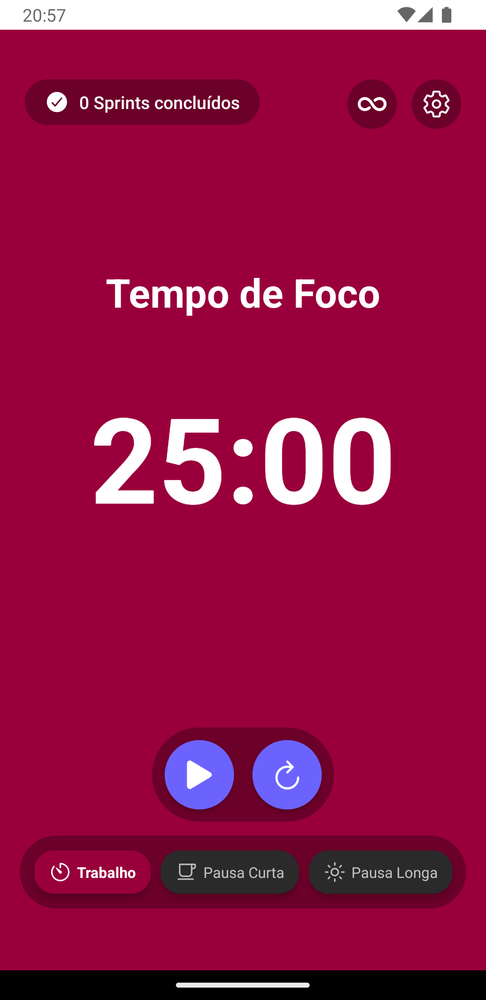
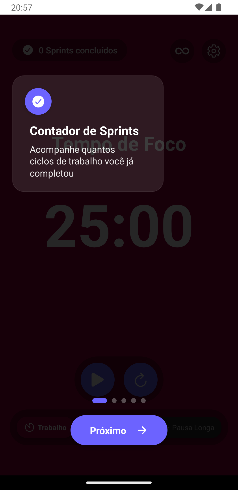
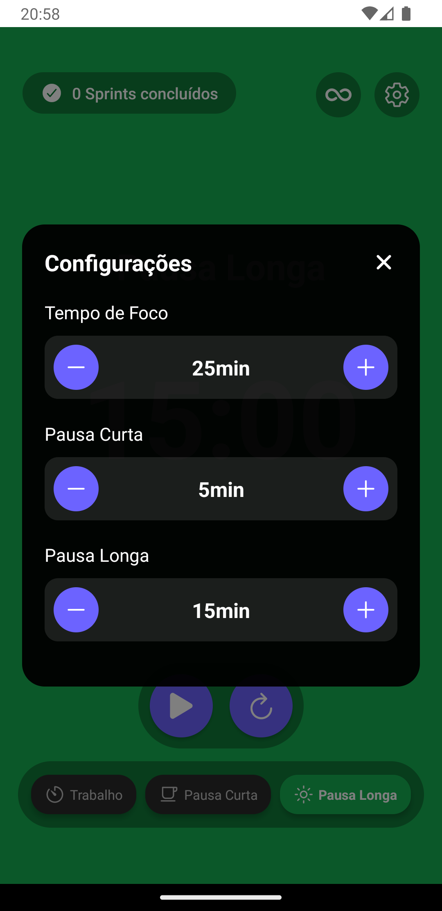

# App Mobile com React Native e Expo

## Sobre o Projeto
Aplicativo mobile desenvolvido com React Native e Expo, apresentando funcionalidades como contador de sprints, sistema de notificações e tutoriais interativos.

## Tecnologias Principais
- React Native
- Expo
- TypeScript
- React Navigation
- React Native Reanimated

## Componentes Principais

### Toast
Sistema de notificações toast para feedback do usuário
- Animações suaves
- Posicionamento automático
- Suporte a mensagens customizadas

### Sprint Counter
Contador para gerenciamento de sprints

### Tutorial
Sistema de tutorial interativo para novos usuários

## Screenshots

<div style="display: flex; flex-direction: row; gap: 20px; flex-wrap: wrap;">

<div>
  <h3>Tela Inicial 🏠</h3>
  
  <ul>
    <li>Visualização do contador principal</li>
    <li>Botões de controle do timer</li>
    <li>Status atual da sessão</li>
  </ul>
</div>

<div>
  <h3>Tutorial Interativo 📚</h3>
  
  <ul>
    <li>Telas de onboarding</li>
    <li>Instruções de uso</li>
    <li>Dicas importantes</li>
  </ul>
</div>

<div>
  <h3>Configurações ⚙️</h3>
  
  <ul>
    <li>Ajustes de tempo</li>
  </ul>
</div>

</div>

## Como Instalar

```bash
git clone https://github.com/bruno167/rn-pomodoro-portifolio.git

cd rn-pomodoro-portifolio

npm install
```	

## Configuração do Ambiente

### Pré-requisitos
- Node.js (versão 14 ou superior)
- npm ou yarn
- Expo CLI (`npm install -g expo-cli`)
- Expo Go instalado no dispositivo móvel (para desenvolvimento)

```bash
# Iniciar o projeto
npx expo start

# Modo desenvolvimento iOS
npx expo run:ios

# Modo desenvolvimento Android
npx expo run:android